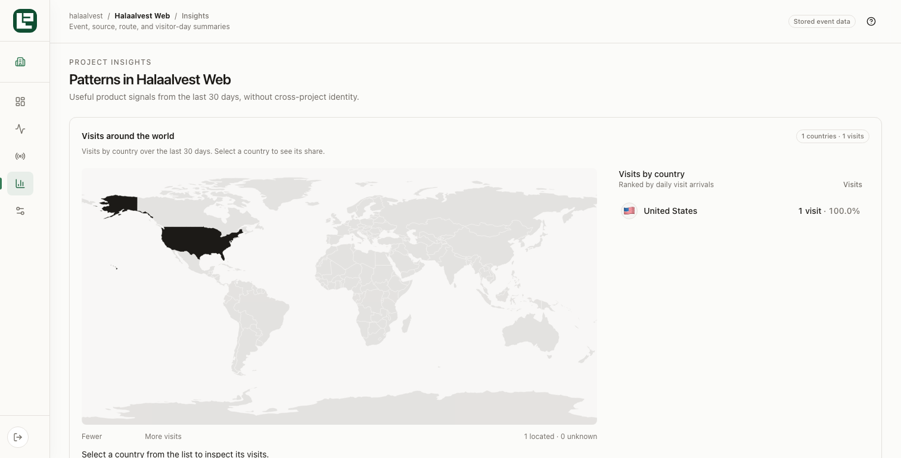
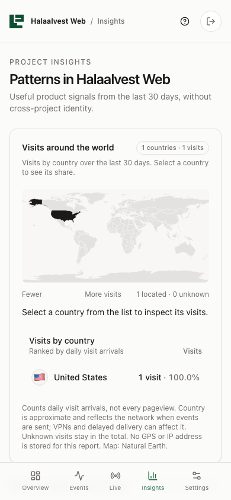

# Country analytics production QA — 2026-09-12

## Result

Chrome loaded the promoted Halaalvest marketing site, then the authenticated Logly Insights workspace for `halaalvest-web`. The new browser arrival was stored and rendered as United States with 1 visit and 100.0% of located visits. The browser automation network exited through the United States, so this is the expected delivery-edge country for this test.

The United States polygon was the only active map region: its computed heat opacity was `1`, while countries without visits remained at `0.15`. Selecting the country set `aria-pressed=true`, increased the polygon outline from `0.6` to `2`, and displayed `United States: 1 visit (100.0% of all visits)`.

## UI improvement and validation

- Added an ISO-code flag to every ranked country row.
- Added the explicit `Visits by country` section title and `Visits` column label.
- Counts now read `1 visit` or `n visits` and retain percentage share.
- Added a visible fewer-to-more heat legend.
- Moved the heat-opacity calculation into a tested presentation helper with clamping at full intensity.
- Desktop viewport: 1512×771, no horizontal overflow, no console warnings or errors.
- Mobile viewport: 390×844, no horizontal overflow, no console warnings or errors.
- Focused country tests: 5 passed, 24 assertions.
- Full repository test, lint, typecheck and dashboard production build passed. A standalone dashboard typecheck was rerun successfully after the production build.
- Production deployment `dpl_CjsARB4jVyf5NKiKMFYRHk7inKJf` reached Ready and owns `https://logly-chi.vercel.app`.

The country metric is one browser arrival per visitor per UTC day. Reloading the same browser on the same day does not inflate the count.

## Screenshots

## Health score

- Before: 82/100. Production ingestion, country count and map shading worked; the list lacked flags and used terse count text.
- After: 100/100 for the requested flow. Live ingestion, ranking, flag, explicit count, percentage, heat intensity, selection, responsiveness and console health all passed.
