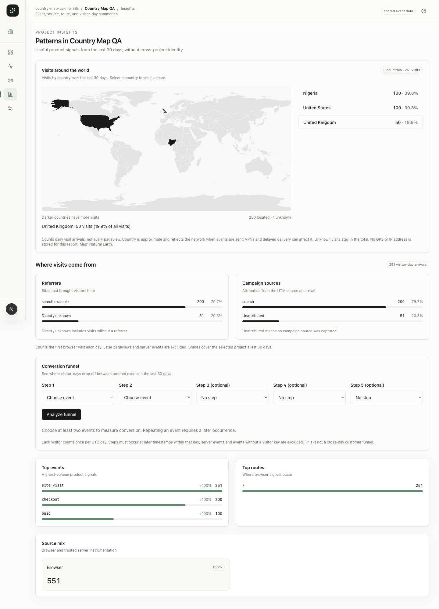
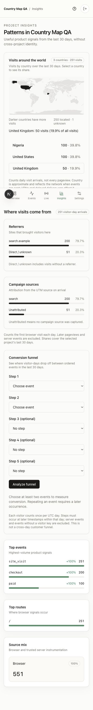
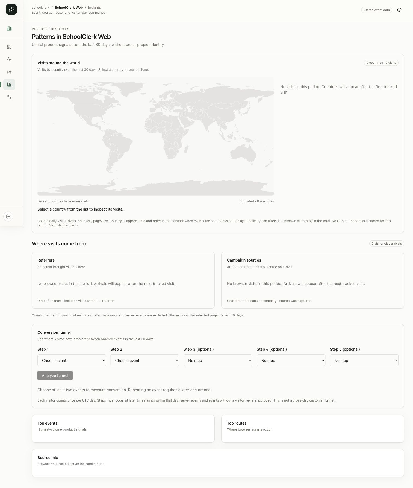
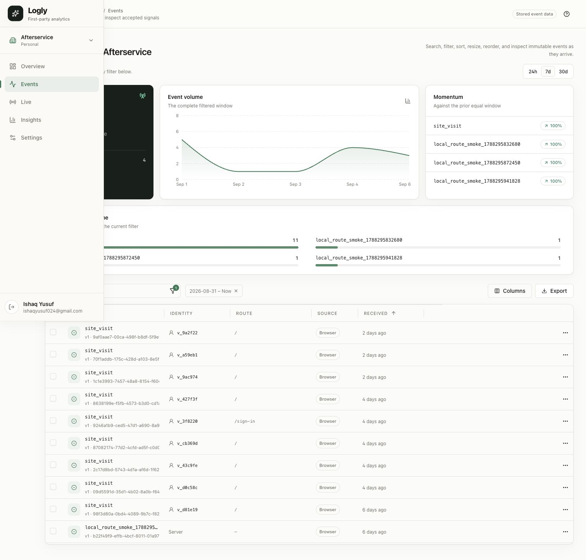

# Country heat map implementation report

## Behavior

Country-shaded world map, ranked visit counts, percentage selection, explicit unknown count, and desktop/mobile layouts in Insights. Scope is the selected project and last 30 days. Metric is daily browser `site_visit` arrivals, not pageviews or cross-day unique people. The first accepted country survives retries. Locations reflect the delivery network; historical data stays unknown.

## Validation

- `bun run test`, `bun run typecheck`, `bun run lint`, `bun run build:dashboard`: pass. Source suite: 52 tests.
- `bun --env-file=.env.local packages/db/scripts/verify-country.ts`: pass, guarded local port 55438; 251 arrivals = Nigeria 100, United States 100, United Kingdom 50, unknown 1. Duplicate first-batch retry with France retains original counts/location. Organization/name/source exclusion and acquisition/funnel regression checks pass. Fixtures retained.
- Chrome: 1440px desktop and 390px mobile, map and ranked-list selection, no horizontal overflow. Fixed SVG title hydration mismatch; fresh reload has no new console errors.
- Populated screenshots use clearly named local QA data, not production traffic.

## Release

Released commit `7f9e1ab` to https://logly-chi.vercel.app via Git deployment `dpl_286efzufYcQir5m2NVhMgWhX59F5` (Ready). Deployment logs confirm migration success; `/health` returns 200 with the expected collector payload. Authenticated Chrome confirms SchoolClerk's empty map (zero visits) and Afterservice's 11 historical visits (all unknown), preserving the selected organization/project and with no production console errors. No consumer-site testing was performed.

Next adapter 0.2.1 package contents inspected (8 files; no secrets). The user explicitly approved npm publication after the initial automatic review rejection. `npm publish --access public` succeeded on 2026-09-07 using existing authentication; npm reported processing in progress. Registry metadata and the published tarball are now verified: version 0.2.1, SHA-1 `9c1d3bd02bcffe4e5e6576ca196ff5d980985683`, eight allowlisted package/runtime/README files, and the built product-edge country forwarding code. Logly uses the workspace adapter and can collect new country metadata upon dashboard deployment. Existing external proxies require the updated adapter or equivalent trusted metadata forwarding and a consumer deployment; no consumer live testing is claimed.

## Sources

[Vercel geographic headers](https://vercel.com/kb/guide/geo-ip-headers-geolocation-vercel-functions), [Natural Earth public-domain terms](https://www.naturalearthdata.com/about/terms-of-use/). Map provenance is recorded in `apps/dashboard/src/data/world-map.LICENSE.md`.

## Brain impact check

Updated: `.brain/api/contracts.md`, `.brain/api/endpoints.md`, `.brain/database/schema.md`, `.brain/database/migrations.md`, `.brain/features/first-party-analytics.md`, `.brain/decisions/0007-country-visit-map.md`, `.brain/tasks/in-progress.md`, `.brain/tasks/country-map/plan.md`, this report, `.brain/BRAIN.md`, and `ai/plan.md`. Country metadata adds an event column and report field; authentication, organization relationships and retention policy are unchanged.

The user is away from their laptop; any further interactive authentication must be deferred. No new login was required for npm publication.
