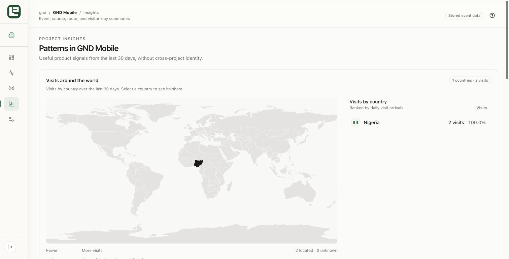
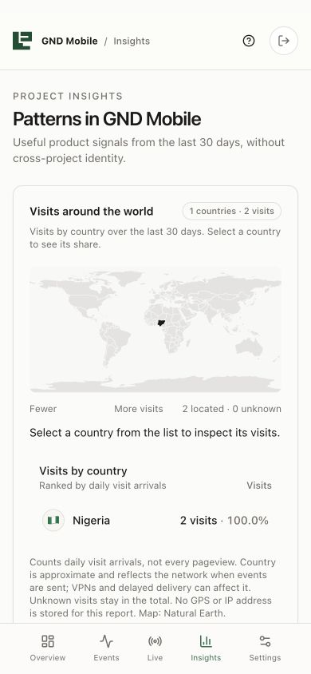
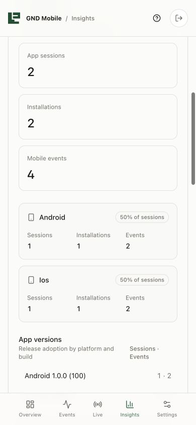
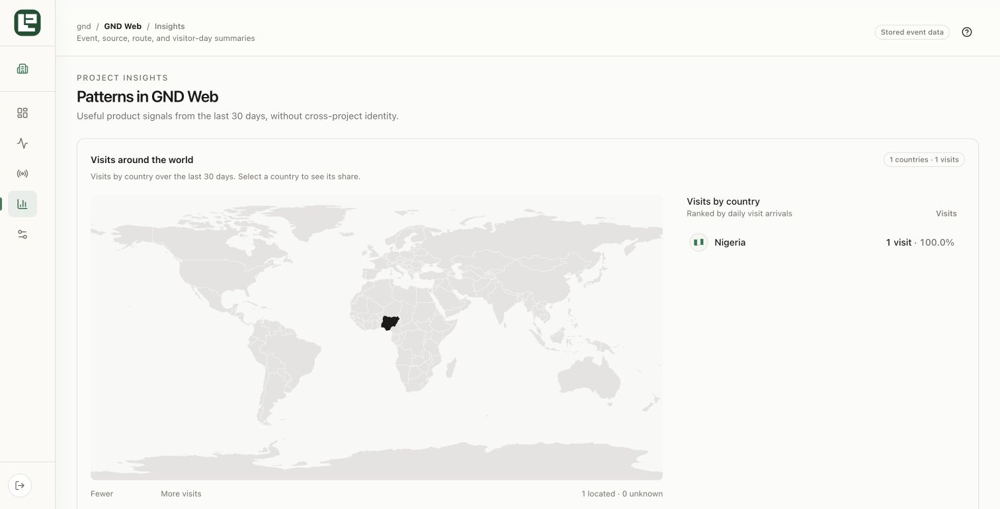
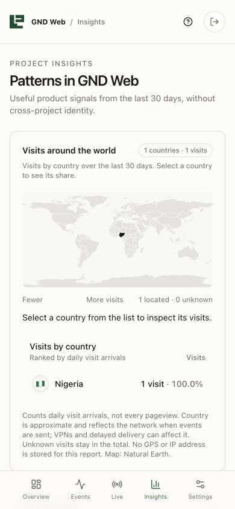

# GND Logly replacement production QA — 2026-09-13

## Result

GND web and mobile now report to separate Logly projects. The production mobile proxy accepted a four-event canary containing one `app_session` and one `screen_view` for each of Android and iOS. The dealership proxy accepted a browser `site_visit`. All five events were stored with zero duplicates.

The authenticated Logly dashboard rendered the delivery-edge country as Nigeria. `gnd-mobile` shows 2 visits and `gnd-web` shows 1 visit. Each project shows Nigeria with its flag, explicit visit count, 100.0% share and the active map polygon at the maximum heat intensity for its dataset. Unknown visits are zero.

## Mobile usage

- App sessions: 2.
- Installations: 2 project-scoped pseudonymous installation IDs.
- Mobile events: 4.
- Android: 1 session, 1 installation, 2 events, 50% of sessions.
- iOS: 1 session, 1 installation, 2 events, 50% of sessions.
- Release breakdown: version `1.0.0`, build `100` for both platforms.
- No GPS, advertising ID, email address, raw authenticated user ID or form value is collected.

## Production releases

- Logly: `dpl_96sWMrTpe48DiDTgDr1H7sM5thXc` on `https://logly-chi.vercel.app`.
- GND API: `dpl_5hsNq7h4N3aC3MMUX8RfS4MFD5FS` on `https://api.gndprodesk.com`.
- GND dealership: `dpl_EkTJ3sxtcyHxPHvowA4UNQQTMMTK` on `https://dealers.gndprodesk.com`.
- Full GND replacement branch: `codex/gnd-logly-complete`.
- Production-compatible GND API hotfix branch: `codex/gnd-logly-api-prod`.

The GND Bun runtime required decoding Vercel's base64 request body before constructing the Fetch `Request`. The proxy also trims encrypted environment values before schema validation and forwarding. Focused GND validation passes with 4 tests, 13 assertions and the `@gnd/events` typecheck.

## Screenshots

## Acceptance

- Country ingestion through real production edges: passed.
- World map heat state and ranked visit list: passed.
- Country flag, explicit count and percentage: passed.
- Android/iOS sessions, installations, events and release metadata: passed.
- Desktop and 390-pixel responsive presentation: passed.
- OpenPanel replacement: complete in current GND source and live dealership instrumentation.
